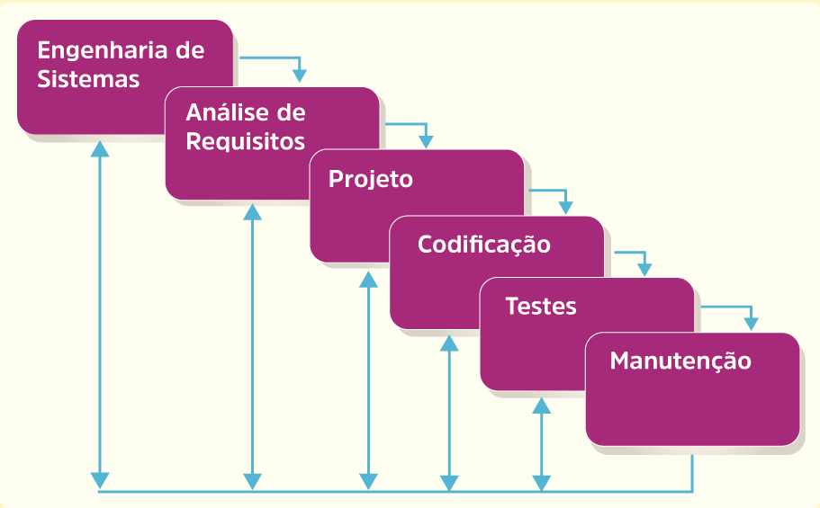
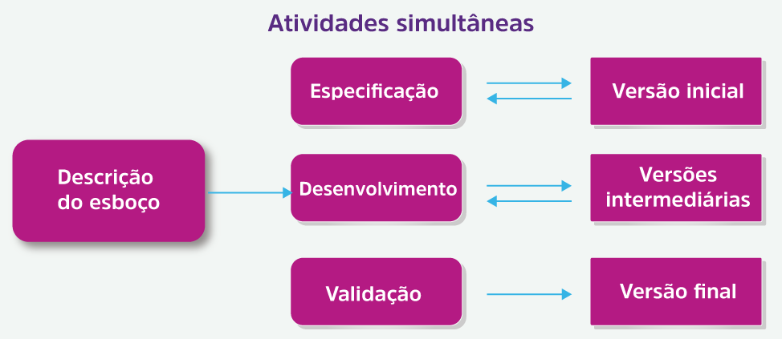

### Modelos de Processos de software
&emsp;Os modelos de processos de software são modelos que auxiliam no processo de construção de um sistema, desde o levantamento de requisistos até o funcionamento em produção e sua manutenção. Entre esses modelos alguns se destacam por sua eficiência, tempo em atividade e evolução ao longo dos anos (lembrando que não existe regra sobre qual modelo usar e qual o mais eficiente, cada um tem seus prós, contras e melhores casos de uso, e pode-se também aproveitar algumas características ou etapas de vários modelos sem a necessidade de usar o modelo completo).

#### Modelo em cascata 
&emsp;O modelo em cascata ou waterfall, representa um detalhamento de suas atividades em um processo linear onde para avançar em um processo é necessário concluir o atual, esse processo é útil em casos que os requisitos do sistema são muito bem definidos e que não haja mudanças, já que após um processo ser concluído ele fica para trás até o reinício do cliclo.

&emsp;Também não há capacidade de ver e experimentar o software até que o último estágio de desenvolvimento seja concluído, o que resulta em altos riscos do projeto e resultados imprevisíveis. Os testes, geralmente, são apressados, ​​e os erros são caros para corrigir  

  

### Modelo Incremental
&emsp;Especifica e implementa uma parte do software que é revisada e outros requisitos adicionados e implementados em grupos.
&emsp;É como se o sistema fosse desenvolvido em pequenos pedaços e validados pelo cliente
e cada acerto se mantém e a cada passo gera uma aplicaçao mais polida e próxima do resiltado final.
&emsp;Cada versão entrega um produto operacional, apresentando aos clientes funcionalidades importantes primeiro, reduzindo os custos de entrega inicial. O risco de alterar os requisitos é bastante reduzido e os cliente podem responder a cada construção.
&emsp;Apesar de seus pontos fortes, esse modelo requer um bom planejamento e definição precoce do sistema completo e totalmente funcional. Também requer interfaces de módulo bem definidas. A figura abaixo ilustra esse modelo.

