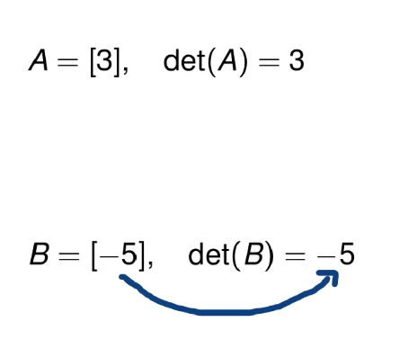
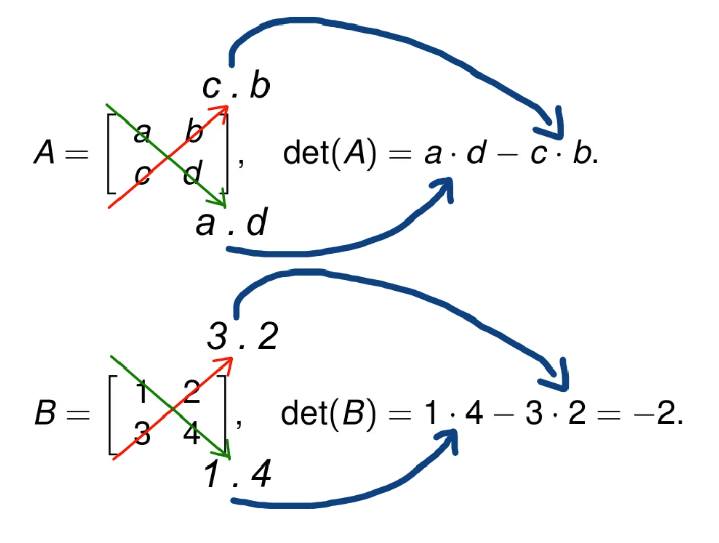
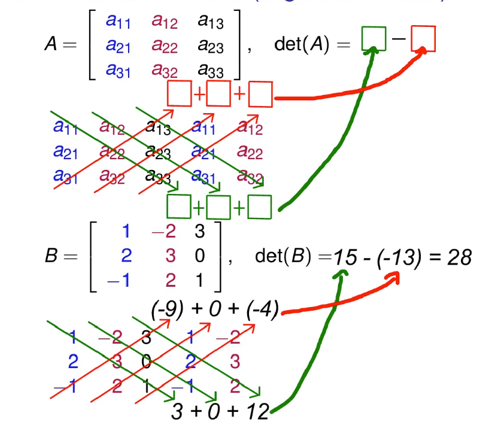
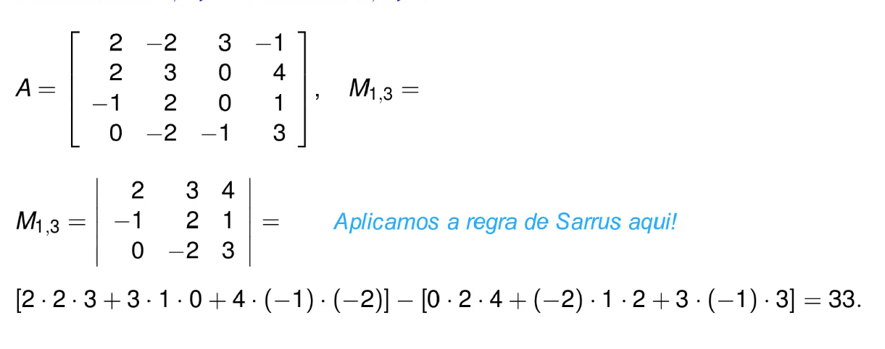
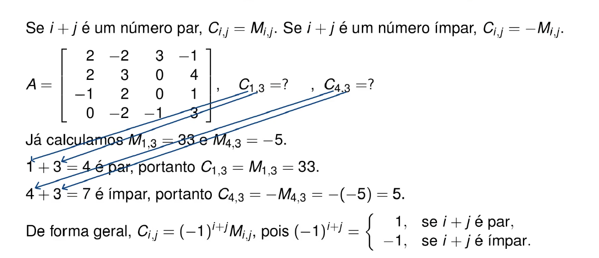
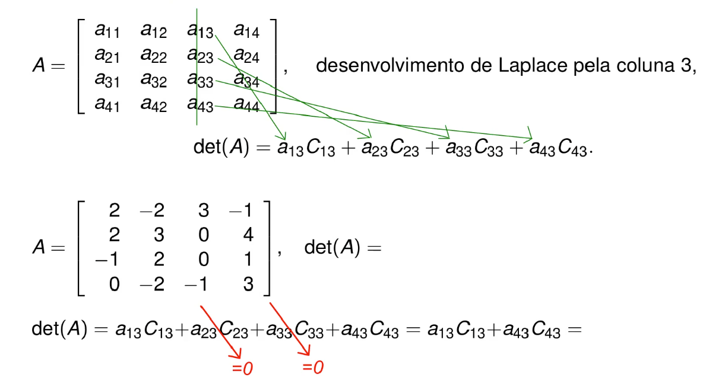

## Determinante

#### O que é um determinante?
&emsp;Um determinante é uma função que mapeia uma matriz quadrada em um escalar real (valor único). Em matemática, o determinante de uma matriz quadrada A é mostrado como det(A) ou |A|.

&emsp;Assim como a própria matemática, o determinante tem uma longa história que remonta aos matemáticos chineses. Na China antiga, os matemáticos usavam determinantes para resolver sistemas de equações lineares (seu método de resolução de equações lineares é hoje chamado de Regra de Cramer). Mais tarde, na Europa do século XVI, o matemático Cardano trouxe os determinantes à tona, aplicando-os na solução de sistemas de equações lineares. Mais tarde, Takakazu (século XVII), Leibniz (século XVII), Vandermonde e Cauchy (século XVIII) estabeleceram a base teórica dos determinantes na matemática pura.

##### Como calcular?
&emsp;**Matrix de ordem 1 (1 x 1)**
O determinante é o valor do único elemento presente na matrix.

&emsp;**Matrix de ordem 2 (2 x 2)**
O determinante é o valor da multiplicação dos números da diagonal principal subtraído pela multiplicação dos números da diagonal secundária.

&emsp;**Matrix de ordem 3 (3 x 3) (usando regra de Sarrus)**
Consiste em escrever as três colunas da matriz e repetir as duas primeiras colunas, logo depois deve-se somar o resultado da multiplicação das três primeiras diagonais da parte superior da matrizm, e subtrair pela soma do resultado da multiplicação das três primeiras colunas inferiores da matriz 

&emsp;**Matrix de qualquer ordem acima de dois (teorema de Laplace)**
Para entender esse teorema precisamos de dois conceitos preliminares, que são,
menor complementar e cofator

##### Menor complementar
&emsp;É um número que se calcula a partir de uma matrz e de uma entrada dessa matriz. Existe o menor complementar de entrada 1,1 da entrada 1,2 etc...
O exemplo a seguir mostra como se calcula o menor complementar da posição 1,3 de uma matriz 4x4.

note que eliminamos a linha 1 e a coluna 3 e logo após aplicamos a regra de Sarrus na nova matriz 3x3.

##### Menor complementar
&emsp;O cofator é um número que se calcula com base no menor complementar mas alterando seu símbolo com base na doma dos indícies da entrada. \
Por exemplo: 

##### Demonstrando o teorema
&emsp;Agora que já conhecemos menor complementar e cofator vamos falar sobre o teorema de Laplace. Para calcular o determinante usando esse teorema deve-se escolher qualquer linha ou coluna da matriz e somar o resultado de aij . Cij, para cada elemento da linha ou coluna escolhida. \
Por exemplo:
