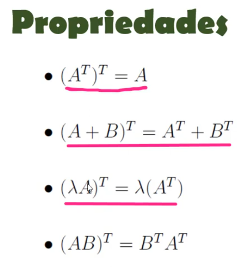

## Matrizes

&emsp;Matriz é uma estrutura matemática disposta em tabela e que possui as operações de adição, subtração e multiplicação muito bem definidas.

&emsp;A definição matemática de uma matriz de ordem (m x n) é uma tabela de números dispostos em m linhas e n colunas.

##### Notação:
&emsp; A = [**a**ij]3X2
A é a matriz, **a** é o elemento, i o número da linha, e j o número da coluna que ele se encontra, cada elento possui seu endereço na forma da notação acima.

#### Tipos de matrizes:  
&emsp;Lembrando que uma matriz pode ter vários tipos.  
##### Matriz Linha:  
&emsp;São matrizes que possuem apenas uma única linha.  
Matematicamente: m = 1.  
Por exemplo:   

    [1 , 2, 3, 4] = 1 X n

##### Matriz Coluna:  
&emsp;São matrizes que possuem apenas uma única coluna.  
Matematicamente: n = 1.  
Por exemplo:  

            [1]
            [2]  = 1 X n
            [3]

##### Matriz Nula:
&emsp;Todas as suas entradas são 0  
Matematicamente: **a**ij = 0.  
Por exemplo:  

    A = 0 0 0
        0 0 0 
        0 0 0

##### Matriz Quadrada:  
&emsp;Matrizes que o número de linhas e colunas são iguais  
Matematicamente: m = n.  
Por exemplo:  
    
    A = 1 2 3 5
        5 2 5 5
        1 0 4 4
        1 3 3 7

A matriz quadrada possui alguns subgrupos como:
##### Matriz Identidade:
&emsp;Possui 1 na diagonal principal e 0 nos endereços restantes:
Por exemplo:

    A = 1 0 0
        0 1 0
        0 0 1

##### Matriz Diagonal:
&emsp;Todos os valores fora da diagonal principal são 0.
Por exemplo:

    A = -5 0 0
         0 2 0
         0 0 1

##### Matriz Escalar:
&emsp;Possui valores iguais na diagonal principal e 0 nos endereços restantes:
Por exemplo:

    A = 2 0 0
        0 2 0
        0 0 2

##### Matriz Triangular Superior:
&emsp;Possui valores localizados apenas no triângulo da parte de cima da  matriz 
Por exemplo:

    A = 2  1 -7
        0  5  4
        0  0  8

##### Matriz Triangular Inferior:
&emsp;Possui valores localizados apenas no triângulo da parte de baixo da  matriz 
Por exemplo:

    A =  2 0 0
         3 6 0
        -7 4 2

#### Operações com matrizes:
##### Adição:
&emsp;Para realizar a adição de uma matriz A à uma matriz B, primeiramente
as duas tem que ter a mesma quantidade de linhas e de colunas
e depois deve-se somar elemento a elemento da matriz A com os da matriz B o que resulta em uma matiz C
    por exemplo:

        A = 1 2 3   B = 5 -8 7    C = 6  -6 10
            4 8 6       4 -1 0        8   7  6
            7 9 7       4  7 6        11 16 13

##### Multiplicação por escalar:
&emsp;Para multiplicação por escalar (n . Matriz) acontece, o n deve 
multiplicar cada item dentro da matrix
por exemplo:
        
        n = 3            
        A = 1 2 3       (n . A) =    3  6  9            
            4 8 6                   12 24 18       
            7 9 7                   21 27 21

##### Multiplicação de matrizes:  
&emsp;Para a multiplicação de duas matrizes A = (**a**ij)m x n **e** B = (**b**ij) n x p, primeiramente o número de colunas da matriz A deve ser o mesmo número de linhas da matriz B e o resultado é definido como a matriz C = (**c**ij)m x p
perceba que m é o numero de linhas de A e p o número de colunas de B.
A multiplicação pode ser escrita como A . B ou AB
cada elemnto de c terá o valor **c**ij = **a**i1 **b**1j + **a**2j **b**2j + ... + **a**nj **b**nj
Por Exemplo:

     2  1 0  . 1 -2  = 5  -4
     3 -1 4    3  0    16 -2
               4  1
        
A multiplicação de matrizes tem algumas propriedades, como:
##### Associatividade
&emsp;Independente da ordem que se multiplicar matrizes o resultado será o mesmo (A . B) . C = A . (B . C) 

##### Existência de elemento neutro
&emsp;O elemento neutro de uma mulitplicação de matrizes é a matriz identidade, tendo em vista que qualquer matriz A multiplicada pela matriz identidade I, o resultado sra a matriz A

##### Distributividade
&emsp;A distributividade em matrizes se dá ao fato que A (B + C) = AB + AC

##### Atenção
&emsp;A multiplicação de matrizes não é comutativa então AB != BA  

#### Transposição  
##### Notação:  

&emsp;A transposta de uma matriz A = (**a**ij)m x n é a matriz B = (**b**ij)n x m tal que **b**ij = **a**ji, ou seja é uma matriz que inverte as linhas pelas colunas.  
Por exemplo:

        A =  0 1  2  3   Sua transposta será:   B = 0 -1  2  
            -1 2  1  4                              1  2  0
             2 0  6  0                              2  1  6
                                                    3  4  0

##### Propriedades da transposição
