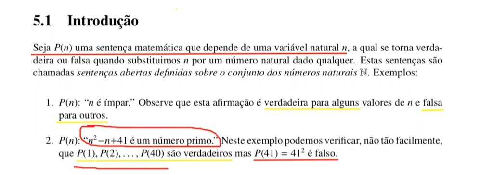
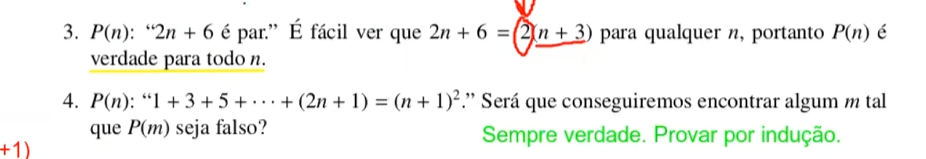

Introducao
    A indução matemática é um método de prova para demonstrar que 
    uma propriedade vale para todos os números naturais, 
    como derrubar uma fila de dominós: prova-se que o primeiro cai (base) e que,
    se um cair, o próximo também cai (passo indutivo)
        
    