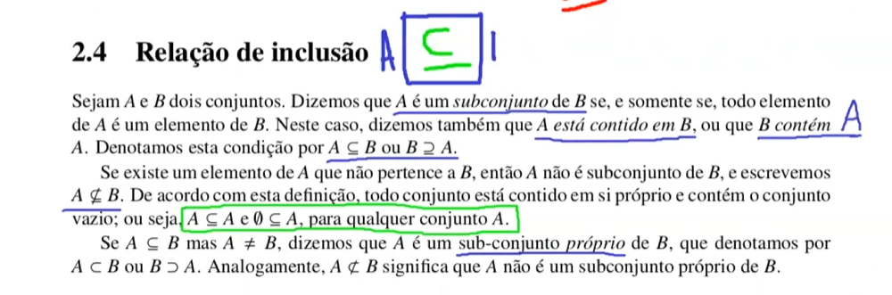

    Por definição um conjunto A é igual a um conjunto B SE, E SOMENTE SE,
todos elemento de A é elento de B, e todo elemento de B é elemento de A.
Ex: {1,2,3} é igual à {2,1,3} independente da ordem dos elementos
Essa condição é denotada po A = B

    Conjunto Vazio
Um conjunto que não possui nenhum elemento

    Relação de Inclusão
Se um conjunto A faz parte ou é um subconjunto de B então
A está contido em B

    Cardinalidade
A definição de quantos elementos o conjunto tem

