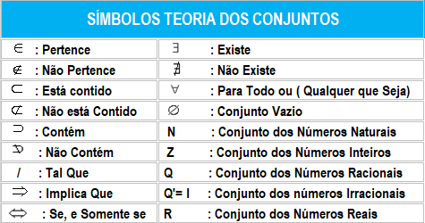
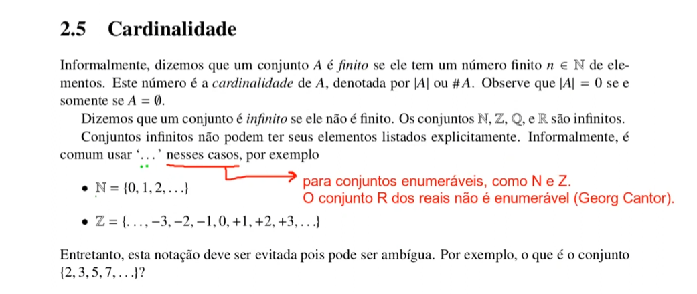
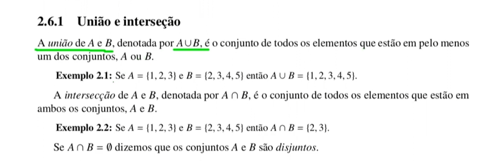
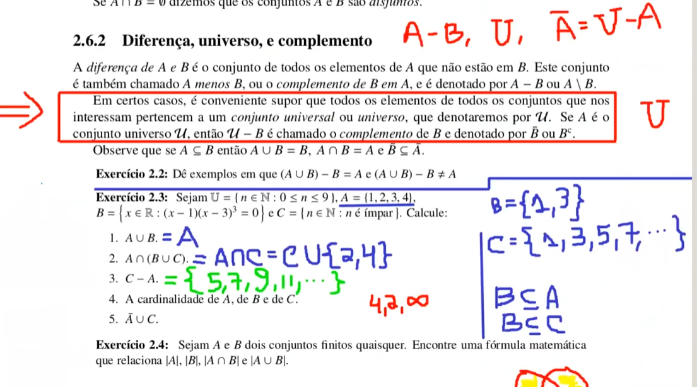

Operadores
    

Igualdade
    Por definição um conjunto A é igual a um conjunto B SE, E SOMENTE SE,
    todos elemento de A é elento de B, e todo elemento de B é elemento de A.
    Ex: {1,2,3} é igual à {2,1,3} independente da ordem dos elementos
    Essa condição é denotada po A = B

Conjunto Vazio
    Um conjunto que não possui nenhum elemento
    

Relação de Inclusão
    Se um conjunto A faz parte ou é um subconjunto de B então
    A está contido em B
    

Cardinalidade
    A definição de quantos elementos o conjunto tem
    

União e interseção
    A união é a junção de todos os elementos de n conjuntos
    onde vai ser criado um novo conjunto com os elementos de A e B, mas sem repetições
    Ex: A = {1,2,3} e B = {2,3,4,5} a união dos dois será = {1,2,3,4,5}

    Já a interceção é o conjunto de todos os elemento que estão em ambos conjuntos 
    Ex: A = {1,2,3} e B = {2,3,4,5} a interceção dos dois será = {2,3}
   

União e interseção
    A união é a junção de todos os elementos de n conjuntos
    onde vai ser criado um novo conjunto com os elementos de A e B, mas sem repetições
    Ex: A = {1,2,3} e B = {2,3,4,5} a união dos dois será = {1,2,3,4,5}

    Já a interceção é o conjunto de todos os elemento que estão em ambos conjuntos 
    Ex: A = {1,2,3} e B = {2,3,4,5} a interceção dos dois será = {2,3} l
   

Diferença, Universo e complemento
    

