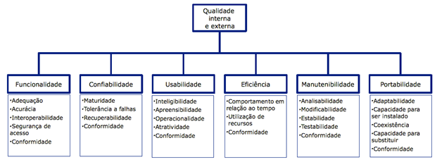

### Introução
#### O que é?
&emsp;Inicialmente o Golssário do IEEE define qualidade como “Grau de conformidade de um sistema, componente ou processo com os respectivos requisitos”, ou, alternativamente, como “Grau de conformidade de um sistema, componente ou processo com as necessidades e expectativas de clientes ou usuários”

Norma ISO 9126 de forma ilustratica abaixo:

&emsp;A forma de mensurar a qualidade é usando uma dessas características de qualidade da norma ISO 9126 e dividí-lo em subcaracterístiscas que serão medidas conforme um valor agregado e com base na eficiência e segurança do código e a experiência do usuário

#### Funcionalidade
&emsp;A capaciadade do sistema de prover funcionalidades que satisfaçam o cliente, e quee podem ou não serem explícitas.
**Subcaracterísticas:** Adequação, Acurácia, Interoperabilidade, Segurança e conformidade

#### Confiabilidade
&emsp;A capacidade de um produto de software de ter um nível de desempenho e integridade especificados quando exposto em condições especificadas ou exepcionais
**Subcaracterísticas:** Maturidade, Tolerância a falhas, Recuperabilidade e conformidade

#### Usabilidade
&emsp;A capacidade de um produto ser de faácil uso, intuítivo e atraente ao usuário e que não necessáriamente vão possuir interface para o usuário final.
**Subcaracterísticas:** Integibilidade, Apreensibilidade, Operacionalidade, Proteção frente a erros de usuários, Estética/Atratividade, Acessibilidade e conformidade.

#### Eficiência
&emsp;O tempo de execução e os recursos envolvidos são compatíveis com o nível de desempenho do software.
**Subcaracterísticas:** Comportamento em relação ao tempo, Utilização de recursos e conformidade.

#### Manutenibilidade
&emsp;A capacidade de um produto de ser mantido e incrementado ao longo do seu ciclo de vida.
**Subcaracterísticas:** Analisabilidade, Modificabilidade, Estabilidade, Testabilidade e Conformidade.

#### Portabilidade
&emsp;A capacidade do sistema ser transferido de um ambiente para outro.
Como 'ambiente', devemos considerar todos os fatores de adaptação, tais como diferentes condições de infraestrutura (sistemas operacionais, versões de bancos de dados etc.), diferentes tipos e recursos de hardware (tal como aproveitar um número maior de processadores ou memória). Além desses, fatores como idioma ou a facilidade para se criar ambientes de testes devem ser considerados como características de portabilidade.
**Subcaracterísticas:** Adaptabilidade, Capacidade para ser instalado, Coexistência, Capacidade para substituir e Conformidade.

#### Qualidade em Uso
&emsp;Capacidade do produto de software permitir que usuários especificados atinjam metas especificadas com eficácia, produtividade, segurança e satisfação em contextos de uso específicos.
**Subcaracterísticas:** Eficácia, Produtividade,  Sergurança e Satisfação.
